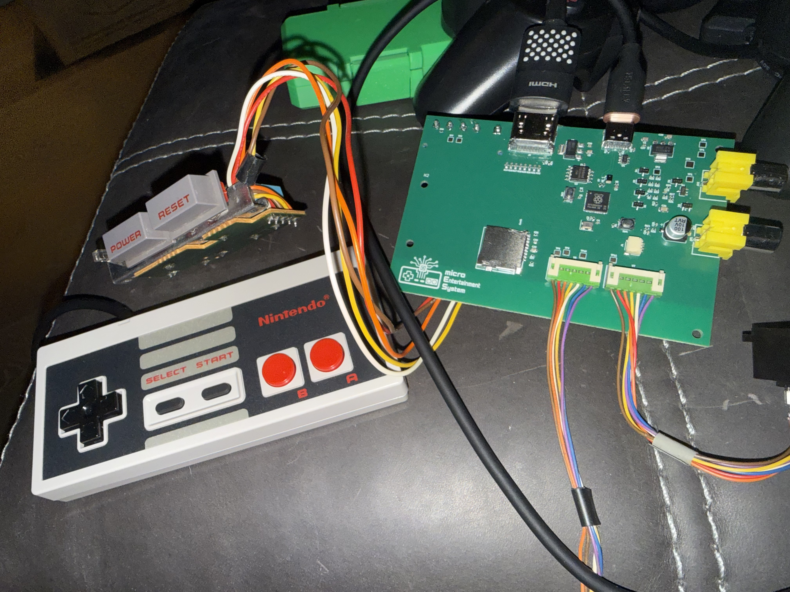

# microNES

<p align="center">
  
</p>

`microNES` is a small RP2350-based NES emulator project with custom hardware,
portable emulator code, and host-side development tools.

The repo now includes a complete KiCad implementation of an RP2350 console-style
board, plus firmware for composite video, HDMI output, SD-card ROM loading,
controller input, and audio. It also includes host tools for building, running,
capturing, and validating the same emulator core on a desktop.

ROM images are not included.

## What This Repo Does

- Runs NES ROMs through a shared C emulator core.
- Targets RP2350 / Raspberry Pi Pico 2-class hardware.
- Provides a fully functional KiCad PCB design under `hardware/microNES_pcb_v0.1`.
- Outputs analog composite video from the RP2350 using PIO/DMA timing.
- Outputs HDMI/DVI-style video using the RP2350 HSTX path.
- Loads ROMs at runtime from SD card, with an optional flash/XIP cache.
- Supports NES controller input.
- Produces audio through PWM on the Pico targets, with a MAX98357 I2S path for
  the TFT audio target.
- Builds host tools for smoke tests, SDL play, PNG frame dumps, WAV dumps, and
  ffmpeg video capture.
- Includes an ESP32-S3 frontend as a separate reference platform.
- Includes an Emscripten/WebAssembly target stub for browser experiments.

## Current Status

The project has moved beyond the original SMB1-only bring-up. The core still
prioritizes pragmatic compatibility over perfect NES accuracy, but the repo now
contains support for several common mapper families:

- NROM / mapper 0
- MMC1
- UxROM
- CNROM
- AxROM
- GxROM
- Color Dreams
- MMC2
- MMC3
- mapper 40

The hardware and firmware path is centered on the RP2350 board in
`hardware/microNES_pcb_v0.1`, with composite and HDMI firmware targets in
`src/pico`. The host path remains the fastest way to validate emulator behavior
before testing on hardware.

## Hardware

The KiCad project lives here:

```text
hardware/microNES_pcb_v0.1/
```

It includes:

- KiCad schematic and PCB files
- custom symbols and footprints
- RP2350 QFN footprint and 3D model support
- microSD slot support
- USB-C support
- NES controller connector footprint
- custom KiCad footprints for original Nintendo console parts
- composite output hardware
- production outputs, BOM, placement files, and Gerbers

The board is designed around harvested original NES console hardware for the
user-facing controls and controller interface. It uses the original Nintendo
power switch assembly and original NES controller input ports, with custom KiCad
footprints made specifically for those salvaged parts.

The older breadboard composite schematic is documented in `SCHEMATIC.md`. The
PCB target is selected in firmware with:

```sh
-DMICRONES_BOARD=v0_1
```

## Repo Layout

```text
src/common/      Portable emulator core, ROM menu, mappers, CPU, PPU, APU, input
src/host/        Desktop smoke runner, SDL runner, PNG/WAV/video tooling
src/pico/        RP2350 firmware, composite, HDMI, TFT, SD, flash cache, audio
src/esp32s3/     Separate ESP32-S3 frontend/reference implementation
src/web/         Emscripten/WebAssembly browser frontend
hardware/        KiCad PCB design, production files, Gerbers, BOMs
tests/           Emulator test ROMs and menu smoke tests
```

## Build

### Host

```sh
cmake -S . -B build-host -DMICRONES_PLATFORM=host
cmake --build build-host -j
```

This builds:

- `build-host/micrones_smoke`
- `build-host/micrones_menu_smoke`
- `build-host/micrones` when SDL3 is available

Run a ROM locally:

```sh
./build-host/micrones roms/smb1.nes
```

Run deterministic smoke validation:

```sh
./build-host/micrones_smoke roms/smb1.nes
```

Capture a frame or video:

```sh
./build-host/micrones_smoke roms/smb1.nes 6200000 /tmp/micrones_10s.png
./build-host/micrones_smoke roms/smb1.nes --steps 17670500 --video-out build-host/capture.mp4
```

### RP2350 / Pico

Configure the firmware for the emulator and the custom PCB:

```sh
cmake -S . -B build-pico \
  -DMICRONES_PLATFORM=pico \
  -DMICRONES_PICO_VIDEO_MODE=emulator \
  -DMICRONES_BOARD=v0_1 \
  -Dpicotool_DIR=/Users/bchelf/microNES/build/_deps/picotool
```

Build composite output:

```sh
cmake --build build-pico --target micrones_pico_analog -j
```

Build HDMI output:

```sh
cmake --build build-pico --target micrones_pico_hdmi -j
```

Other firmware targets:

```sh
cmake --build build-pico --target micrones_pico_tft -j
cmake --build build-pico --target micrones_pico_tft_max98357 -j
cmake --build build-pico --target micrones_pico_hdmi_test_pattern -j
```

The Pico firmware loads ROMs from SD at runtime. `MICRONES_PICO_ROM_PATH` is no
longer needed for normal Pico builds.

### Web

```sh
emcmake cmake -S . -B build-web -DMICRONES_PLATFORM=web
cmake --build build-web -j
```

The build copies `src/web/index.html` next to the generated JS/WASM output.

### ESP32-S3

```sh
cd src/esp32s3
. $IDF_PATH/export.sh
idf.py build
```

## Host Controls

For the SDL runner:

- Arrow keys or `WASD`: D-pad
- `L`: A
- `K`: B
- `Return`: Start
- `Tab` or right shift: Select

Useful runner options:

```sh
./build-host/micrones roms/smb1.nes --vsync
./build-host/micrones roms/smb1.nes --no-vsync --unthrottled
./build-host/micrones roms/smb1.nes --scale 5
./build-host/micrones roms/smb1.nes --dump-wav /tmp/gameplay.wav --dump-wav-seconds 2
```

## Known Limitations

`microNES` is still an emulator under active development, not a fully accurate
general-purpose NES implementation.

- PPU timing is practical rather than fully cycle-accurate.
- Sprite overflow and exact secondary OAM behavior are incomplete.
- APU fidelity is improved but still not perfect.
- Mapper support exists for several common boards, but compatibility is not
  expected to match mature NES emulators.
- Some RP2350 SD-to-flash-cache ROM load paths can still disturb video output
  and are an active debugging area.

## Development Notes

Keep platform boundaries clean:

- `src/common` should stay portable.
- Host-only SDL, PNG, WAV, and ffmpeg code belongs in `src/host`.
- Pico SDK, PIO, DMA, HSTX, SD, and flash code belongs in `src/pico`.
- ESP-IDF code belongs in `src/esp32s3`.

The recommended workflow is still host-first: validate behavior with
`micrones_smoke` and the SDL runner, then test the same core on RP2350 hardware.
